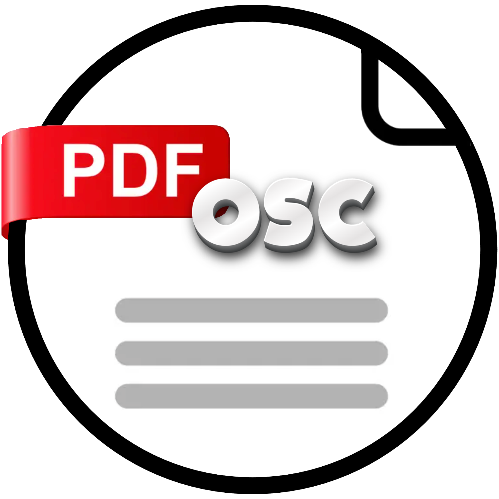

# PDFOSC - Companion Module

<h2>Overview</h2>

 
PDFOSC is a PDF.JS based viewer application that supports Open Sound Control (OSC).  
This module enables OSC communications between Companion and PDFOSC. 
<b>To avoid confusion during live events, OSC feedbacks are restricted to Presentation Mode ON. 
This prevents non-active machines from sending feedbacks that could be mistaken for the live source.</b> 
 
 
With this module, you can: 
- Control PDF document navigation remotely 
- Monitor current page and total page count 
- Visualize Presentation mode status 

## Requirements

- [Bitfocus Companion](https://bitfocus.io/companion) v4.2 or later
- [PDFOSC PDF Viewer](https://github.com/chilibytesdotcom/pdfosc)
- Network connectivity between Companion and the PDFOSC machines

## Installation

1. In Companion, navigate to Connections Tab
2. In "Add Connection" search for "PDFOSC"
3. Click "ADD" to create an instance
4. Configure the PDFOSC module

## Configuration

Configure your module with:

- **Remote IP**: Address of the PDFOSC machine (default: 127.0.0.1)
- **Remote Port**: Port PDFOSC listens for actions (default: 55550)
- **Listen Port**: Port Companion listens for feedbacks from PDFOSC (default: 55551)

## Features

### Actions

- Navigate to next/previous page
- Control document view state

### Variables

- Current page number
- Total pages count
- Document view state

### Feedbacks

- Document view status indicator
- Pages progression visualization

### Presets

The module includes a set of ready-to-use button presets for common functions.

## Documentation

For detailed documentation:

- [User Guide](./companion/HELP.md) - Complete module usage information
- [PDFOSC Application](https://github.com/chilibytesdotcom/pdfosc) - Information about the PDF viewer

## Support

Having issues or suggestions?

- [GitHub Issues](https://github.com/chilibytesdotcom/companion-module-chilibytes-pdfosc/issues) - Report bugs or request features
- [HELP.md](./companion/HELP.md) - Troubleshooting guide

## Version History

### v1.0

- Initial Release

## License

This project is licensed under the [MIT License](./LICENSE).

## Acknowledgements

- Developed and Maintained by [ChiliBytes](https://chilibytes.com)
- Built for [Bitfocus Companion](https://bitfocus.io/companion)
